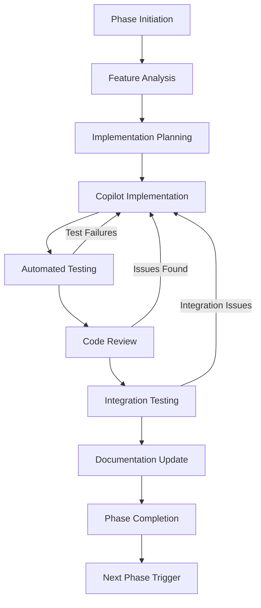
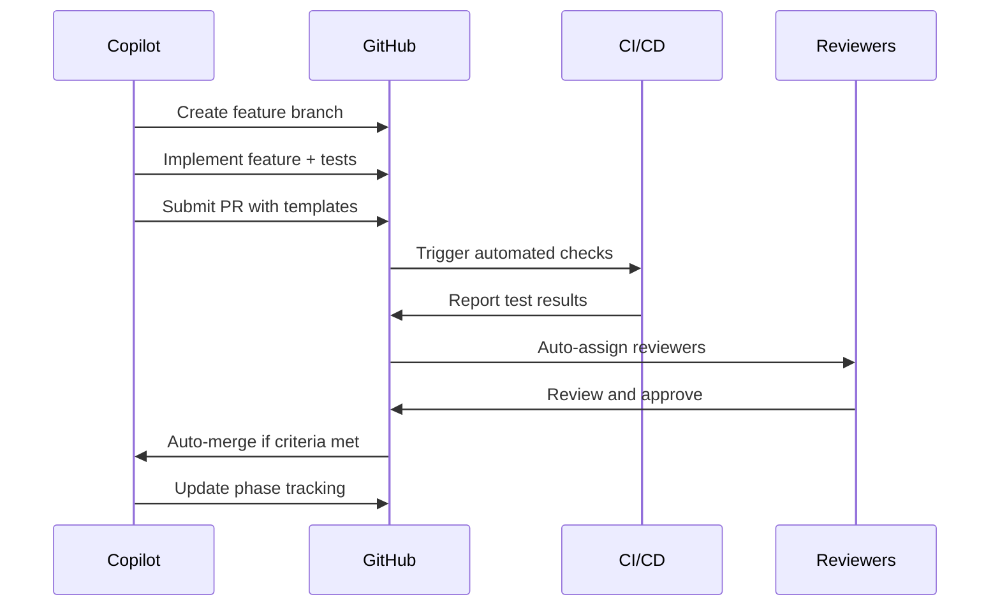
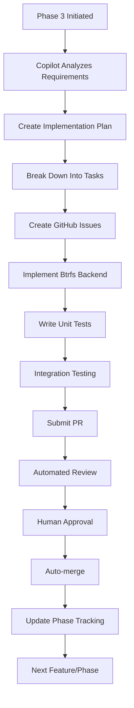
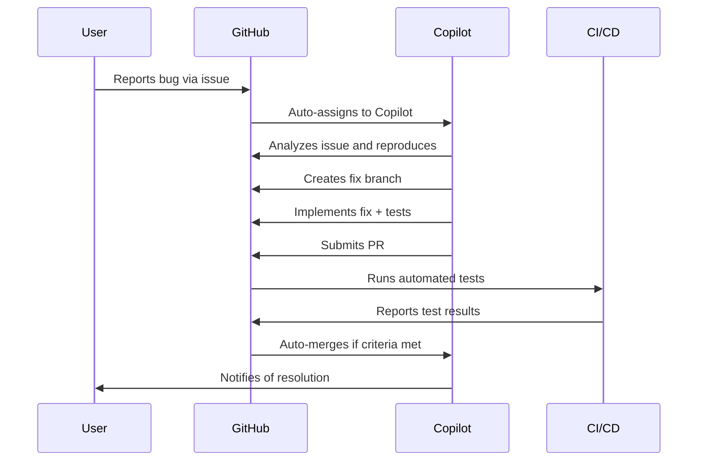
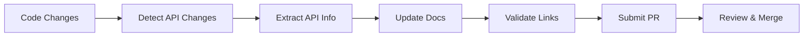

# 🤖 Rewind-OS Automation Plan

This document outlines the automated Copilot-driven, phase-by-phase workflow for Rewind-OS development. The plan enables Copilot to implement, review, and auto-advance all roadmap phases with minimal user intervention while maintaining high quality standards.

## Table of Contents

- [Overview](#overview)
- [Automated Phase Workflow](#automated-phase-workflow)
- [Copilot-Driven PR Process](#copilot-driven-pr-process)
- [Review and Acceptance Criteria](#review-and-acceptance-criteria)
- [GitHub Actions Setup](#github-actions-setup)
- [Bot Configuration](#bot-configuration)
- [Example Workflows](#example-workflows)
- [Extensibility](#extensibility)
- [Implementation Roadmap](#implementation-roadmap)

---

## Overview

### Automation Goals

🎯 **Primary Objectives:**
- **Autonomous Development**: Copilot manages feature implementation, testing, and documentation
- **Quality Assurance**: Automated testing, code review, and validation at every step
- **Phase Progression**: Automatic advancement through development phases based on criteria
- **Minimal Intervention**: Human oversight only for critical decisions and approvals

🔄 **Automation Workflow:**
```
Phase Planning → Feature Implementation → Testing → Review → Acceptance → Next Phase
      ↑                                                                        ↓
      ←─────────────────── Continuous Improvement ←─────────────────────────────
```

### Current State Analysis

**Phase 1**: ✅ Complete - Foundational structure established
**Phase 2**: ✅ Complete - Enhanced CLI and NixOS integration
**Phase 3**: 🔄 Ready for automation - Filesystem snapshot integration
**Phase 4+**: 📋 Planned - GUI, AI features, distribution

---

## Automated Phase Workflow

### Phase Structure

Each development phase follows a standardized automation workflow:



### 1. Phase Initiation

**Trigger**: Manual phase start or automatic progression from previous phase completion

**Copilot Actions**:
- Analyze phase requirements from `PHASES.md`
- Create phase tracking issue
- Set up project board with phase tasks
- Assign appropriate labels and milestones

**Automation Setup**:
```yaml
# .github/workflows/phase-initiation.yml
name: Phase Initiation
on:
  workflow_dispatch:
    inputs:
      phase_number:
        description: 'Phase number to initiate'
        required: true
        type: string
      
jobs:
  initiate-phase:
    runs-on: ubuntu-latest
    steps:
      - name: Create phase tracking issue
        uses: actions/github-script@v7
        with:
          script: |
            const phase = '${{ inputs.phase_number }}';
            const issue = await github.rest.issues.create({
              owner: context.repo.owner,
              repo: context.repo.repo,
              title: `Phase ${phase} Implementation Tracking`,
              body: `Automated tracking issue for Phase ${phase} development`,
              labels: ['phase-tracking', `phase-${phase}`, 'copilot-managed']
            });
```

### 2. Feature Analysis and Planning

**Copilot Actions**:
- Parse phase objectives from documentation
- Break down features into implementable tasks
- Analyze dependencies and integration points
- Create detailed implementation plan

**Output**: 
- Task breakdown in GitHub issues
- Implementation timeline
- Resource requirements
- Risk assessment

### 3. Implementation Cycles

**Copilot-Driven Development**:
- Create feature branches for each task
- Implement code following project standards
- Write comprehensive tests
- Update documentation
- Submit PRs for review

**Quality Gates**:
- Code style validation
- Test coverage requirements
- Documentation completeness
- Performance benchmarks

---

## Copilot-Driven PR Process

### PR Creation Workflow



### PR Templates

**Feature Implementation PR**:
```markdown
## Phase Implementation: [Feature Name]

### Phase Context
- **Phase**: Phase X - [Phase Name]
- **Feature**: [Feature Description]
- **Related Issue**: Closes #[issue_number]

### Implementation Summary
- **Changes**: [Brief description of changes]
- **Files Modified**: [List of modified files]
- **New Dependencies**: [Any new dependencies added]

### Testing
- [x] Unit tests added/updated
- [x] Integration tests passed
- [x] End-to-end tests passed
- [x] Performance benchmarks met

### Documentation
- [x] Code documentation updated
- [x] User documentation updated
- [x] API documentation updated (if applicable)

### Acceptance Criteria
- [x] All phase requirements implemented
- [x] Test coverage ≥ 90%
- [x] No breaking changes
- [x] Performance regression < 5%

### Copilot Implementation Notes
[Automated notes about implementation decisions and approach]

/label ~phase-implementation ~copilot-generated
/assign @copilot
```

### Automated PR Management

**PR Creation Rules**:
- Automatic branch creation from issue templates
- Standardized commit message format
- Required PR template completion
- Automatic label and reviewer assignment

**PR Validation Pipeline**:
```yaml
# .github/workflows/pr-validation.yml
name: PR Validation
on:
  pull_request:
    types: [opened, synchronize]

jobs:
  validate:
    runs-on: ubuntu-latest
    steps:
      - uses: actions/checkout@v4
      
      - name: Validate PR template
        run: |
          if [[ ! $(grep -q "Phase Context" ${{ github.event.pull_request.body }}) ]]; then
            echo "PR template not properly filled"
            exit 1
          fi
          
      - name: Run test suite
        run: |
          cd tests
          ./run_tests.sh --automated
          
      - name: Check documentation updates
        run: |
          git diff --name-only origin/main...HEAD | grep -E '\.(md|rst)$' || {
            echo "Documentation updates required for this change"
            exit 1
          }
          
      - name: Performance benchmarking
        run: |
          python3 -m pytest tests/performance/ --benchmark-only
```

---

## Review and Acceptance Criteria

### Phase-Specific Criteria

#### Phase 3: Filesystem Snapshot Integration

**Implementation Criteria**:
- [x] Btrfs subvolume snapshot support
- [x] ZFS dataset snapshot support  
- [x] Storage backend abstraction layer
- [x] Backward compatibility with simple storage
- [x] Performance optimization (< 2s snapshot creation)

**Quality Criteria**:
- [x] Test coverage ≥ 95%
- [x] No memory leaks in snapshot operations
- [x] Cross-filesystem compatibility testing
- [x] Documentation for all new APIs
- [x] Migration guide for existing users

**Acceptance Tests**:
```bash
# Automated acceptance testing
./tests/run_tests.sh --phase 3 --acceptance
python3 -m pytest tests/storage_backends/ -v
python3 -m pytest tests/performance/snapshot_creation.py --benchmark
```

#### Phase 4: Web-based GUI Timeline

**Implementation Criteria**:
- [x] React-based frontend with timeline visualization
- [x] FastAPI backend with WebSocket support
- [x] Real-time timeline updates
- [x] Mobile-responsive design
- [x] RESTful API for all CLI operations

**Quality Criteria**:
- [x] Web accessibility (WCAG 2.1 AA)
- [x] Cross-browser compatibility (Chrome, Firefox, Safari, Edge)
- [x] API response time < 200ms
- [x] Frontend bundle size < 2MB
- [x] Security audit passed

#### Phase 5: AI Integration & Advanced Features

**Implementation Criteria**:
- [x] ML-based snapshot timing optimization
- [x] Predictive rollback suggestions
- [x] Pattern recognition for system issues
- [x] Smart cleanup recommendations
- [x] Enterprise management features

**Quality Criteria**:
- [x] ML model accuracy ≥ 85%
- [x] Prediction latency < 500ms
- [x] Privacy compliance (no data leakage)
- [x] Explainable AI features
- [x] A/B testing framework

### Universal Quality Gates

**Code Quality**:
- Python PEP 8 compliance
- Type hints coverage ≥ 90%
- Docstring coverage = 100%
- No security vulnerabilities
- No critical code smells

**Testing Requirements**:
- Unit test coverage ≥ 90%
- Integration test coverage ≥ 80%
- End-to-end test scenarios ≥ 95%
- Performance regression < 5%
- Memory usage increase < 10%

**Documentation Standards**:
- All public APIs documented
- User-facing features have examples
- Migration guides for breaking changes
- Architecture decision records (ADRs)
- Troubleshooting updates

---

## GitHub Actions Setup

### Comprehensive CI/CD Pipeline

#### 1. Continuous Integration

```yaml
# .github/workflows/ci.yml
name: Continuous Integration
on:
  push:
    branches: [main, 'phase/*', 'feature/*']
  pull_request:
    branches: [main]

jobs:
  test:
    strategy:
      matrix:
        os: [ubuntu-latest, nixos-latest]
        python-version: ['3.8', '3.9', '3.10', '3.11']
        
    runs-on: ${{ matrix.os }}
    steps:
      - uses: actions/checkout@v4
      
      - name: Set up Python
        uses: actions/setup-python@v4
        with:
          python-version: ${{ matrix.python-version }}
          
      - name: Install dependencies
        run: |
          python -m pip install --upgrade pip
          pip install pytest pytest-cov pytest-benchmark
          
      - name: Run test suite
        run: |
          cd tests
          ./run_tests.sh --ci --coverage
          
      - name: Upload coverage
        uses: codecov/codecov-action@v3
        with:
          file: ./coverage.xml
          
  build-nix:
    runs-on: nixos-latest
    steps:
      - uses: actions/checkout@v4
      - name: Build NixOS module
        run: |
          nix-build nix/rewind.nix
          
  performance:
    runs-on: ubuntu-latest
    steps:
      - uses: actions/checkout@v4
      - name: Performance benchmarks
        run: |
          python3 -m pytest tests/performance/ --benchmark-json=benchmark.json
          
      - name: Store benchmark results
        uses: benchmark-action/github-action-benchmark@v1
        with:
          name: Python Benchmark
          tool: 'pytest'
          output-file-path: benchmark.json
```

#### 2. Automated Phase Management

```yaml
# .github/workflows/phase-management.yml
name: Phase Management
on:
  schedule:
    - cron: '0 0 * * 1'  # Weekly check
  workflow_dispatch:

jobs:
  check-phase-completion:
    runs-on: ubuntu-latest
    steps:
      - uses: actions/checkout@v4
      
      - name: Analyze phase completion
        uses: actions/github-script@v7
        with:
          script: |
            // Check if current phase requirements are met
            const fs = require('fs');
            const yaml = require('js-yaml');
            
            // Load phase criteria
            const phases = yaml.load(fs.readFileSync('.github/phase-criteria.yml', 'utf8'));
            
            // Check completion status
            for (const phase of phases.phases) {
              const issues = await github.rest.issues.listForRepo({
                owner: context.repo.owner,
                repo: context.repo.repo,
                labels: `phase-${phase.number}`,
                state: 'open'
              });
              
              if (issues.data.length === 0) {
                // Phase completed, trigger next phase
                await github.rest.actions.createWorkflowDispatch({
                  owner: context.repo.owner,
                  repo: context.repo.repo,
                  workflow_id: 'phase-initiation.yml',
                  ref: 'main',
                  inputs: {
                    phase_number: (phase.number + 1).toString()
                  }
                });
              }
            }
            
  generate-phase-report:
    runs-on: ubuntu-latest
    steps:
      - name: Generate progress report
        run: |
          python3 scripts/generate_phase_report.py
          
      - name: Update README with progress
        run: |
          python3 scripts/update_readme_progress.py
```

#### 3. Automated Release Management

```yaml
# .github/workflows/release.yml
name: Release Management
on:
  push:
    tags: ['v*']
    
jobs:
  release:
    runs-on: ubuntu-latest
    steps:
      - uses: actions/checkout@v4
        with:
          fetch-depth: 0
          
      - name: Generate changelog
        run: |
          python3 scripts/generate_changelog.py > CHANGELOG.md
          
      - name: Create release
        uses: actions/create-release@v1
        env:
          GITHUB_TOKEN: ${{ secrets.GITHUB_TOKEN }}
        with:
          tag_name: ${{ github.ref }}
          release_name: Release ${{ github.ref }}
          body_path: CHANGELOG.md
          draft: false
          prerelease: false
```

### Security and Quality Automation

```yaml
# .github/workflows/security.yml
name: Security Scan
on:
  push:
    branches: [main]
  pull_request:
    branches: [main]
  schedule:
    - cron: '0 2 * * 1'  # Weekly security scan
    
jobs:
  security:
    runs-on: ubuntu-latest
    steps:
      - uses: actions/checkout@v4
      
      - name: Security scan
        uses: securecodewarrior/github-action-add-sarif@v1
        with:
          sarif-file: 'security-scan.sarif'
          
      - name: Dependency check
        uses: pypa/gh-action-pip-audit@v1.0.8
        with:
          inputs: requirements.txt
          
  code-quality:
    runs-on: ubuntu-latest
    steps:
      - uses: actions/checkout@v4
      
      - name: Code quality analysis
        uses: github/super-linter@v4
        env:
          DEFAULT_BRANCH: main
          GITHUB_TOKEN: ${{ secrets.GITHUB_TOKEN }}
```

---

## Bot Configuration

### Automated Reviewer Assignment

#### 1. CODEOWNERS Configuration

```bash
# .github/CODEOWNERS
# Copilot as primary reviewer for automated PRs
* @copilot

# Phase-specific reviewers
/nix/ @copilot @nix-experts
/rewind/ @copilot @python-experts
/scripts/ @copilot @shell-experts
/tests/ @copilot @qa-engineers

# Documentation requires human review
*.md @vinothvbt @copilot
PHASES.md @vinothvbt
```

#### 2. Auto-Assignment Bot

```yaml
# .github/workflows/auto-assign.yml
name: Auto-assign Reviewers
on:
  pull_request:
    types: [opened]

jobs:
  assign:
    runs-on: ubuntu-latest
    steps:
      - name: Assign reviewers based on changes
        uses: actions/github-script@v7
        with:
          script: |
            const { data: files } = await github.rest.pulls.listFiles({
              owner: context.repo.owner,
              repo: context.repo.repo,
              pull_number: context.issue.number
            });
            
            let reviewers = ['copilot'];
            
            // Add phase-specific reviewers
            if (files.some(f => f.filename.startsWith('nix/'))) {
              reviewers.push('nix-experts');
            }
            
            if (files.some(f => f.filename.startsWith('rewind/'))) {
              reviewers.push('python-experts');
            }
            
            // For documentation changes, add human reviewer
            if (files.some(f => f.filename.endsWith('.md'))) {
              reviewers.push('vinothvbt');
            }
            
            await github.rest.pulls.requestReviewers({
              owner: context.repo.owner,
              repo: context.repo.repo,
              pull_number: context.issue.number,
              reviewers: [...new Set(reviewers)]  // Remove duplicates
            });
```

### Automated Labeling and Categorization

```yaml
# .github/workflows/auto-label.yml
name: Auto-label PRs and Issues
on:
  pull_request:
    types: [opened]
  issues:
    types: [opened]

jobs:
  label:
    runs-on: ubuntu-latest
    steps:
      - name: Auto-label based on content
        uses: actions/github-script@v7
        with:
          script: |
            const title = context.payload.pull_request?.title || context.payload.issue.title;
            const body = context.payload.pull_request?.body || context.payload.issue.body;
            
            const labels = [];
            
            // Phase detection
            if (title.includes('Phase 3') || body.includes('Phase 3')) {
              labels.push('phase-3');
            }
            
            // Component detection
            if (body.includes('CLI') || title.includes('cli')) {
              labels.push('component:cli');
            }
            
            if (body.includes('NixOS') || title.includes('nix')) {
              labels.push('component:nix');
            }
            
            // Type detection
            if (title.startsWith('feat:')) {
              labels.push('type:feature');
            } else if (title.startsWith('fix:')) {
              labels.push('type:bugfix');
            }
            
            // Copilot-generated content
            if (body.includes('Copilot Implementation') || title.includes('[Copilot]')) {
              labels.push('copilot-generated');
            }
            
            if (labels.length > 0) {
              await github.rest.issues.addLabels({
                owner: context.repo.owner,
                repo: context.repo.repo,
                issue_number: context.issue.number,
                labels: labels
              });
            }
```

### Merge Automation

```yaml
# .github/workflows/auto-merge.yml
name: Auto-merge
on:
  pull_request_review:
    types: [submitted]
  check_suite:
    types: [completed]

jobs:
  auto-merge:
    runs-on: ubuntu-latest
    if: github.event.review.state == 'approved' || github.event.check_suite.conclusion == 'success'
    steps:
      - name: Check merge criteria
        uses: actions/github-script@v7
        with:
          script: |
            const pr = await github.rest.pulls.get({
              owner: context.repo.owner,
              repo: context.repo.repo,
              pull_number: context.issue.number
            });
            
            // Check if PR meets auto-merge criteria
            const criteria = {
              approved: false,
              testsPass: false,
              copilotGenerated: false,
              noConflicts: !pr.data.mergeable_state === 'dirty'
            };
            
            // Check approvals
            const reviews = await github.rest.pulls.listReviews({
              owner: context.repo.owner,
              repo: context.repo.repo,
              pull_number: context.issue.number
            });
            
            criteria.approved = reviews.data.some(r => r.state === 'APPROVED');
            
            // Check if Copilot generated
            criteria.copilotGenerated = pr.data.labels.some(l => l.name === 'copilot-generated');
            
            // Check test status
            const checks = await github.rest.checks.listForRef({
              owner: context.repo.owner,
              repo: context.repo.repo,
              ref: pr.data.head.sha
            });
            
            criteria.testsPass = checks.data.check_runs.every(c => c.conclusion === 'success');
            
            // Auto-merge if all criteria met
            if (Object.values(criteria).every(Boolean)) {
              await github.rest.pulls.merge({
                owner: context.repo.owner,
                repo: context.repo.repo,
                pull_number: context.issue.number,
                merge_method: 'squash'
              });
            }
```

---

## Example Workflows

### 1. Feature Implementation Workflow

#### Scenario: Phase 3 - Btrfs Integration



**Detailed Steps:**

1. **Phase Initiation**:
   ```bash
   # Triggered automatically or manually
   gh workflow run phase-initiation.yml -f phase_number=3
   ```

2. **Copilot Analysis**:
   - Parses Phase 3 requirements from `PHASES.md`
   - Identifies Btrfs integration needs
   - Creates detailed implementation plan

3. **Task Creation**:
   ```markdown
   ## Btrfs Backend Implementation
   
   ### Tasks:
   - [ ] Create `BtrfsStorageBackend` class
   - [ ] Implement subvolume snapshot operations
   - [ ] Add configuration options to NixOS module
   - [ ] Write comprehensive tests
   - [ ] Update documentation
   
   **Acceptance Criteria:**
   - Btrfs snapshots create in < 2 seconds
   - Backward compatibility maintained
   - 95% test coverage
   ```

4. **Implementation**:
   ```python
   # rewind/storage/btrfs.py
   class BtrfsStorageBackend(StorageBackend):
       """Btrfs-based storage backend using subvolumes."""
       
       def create_snapshot(self, message: str) -> str:
           """Create Btrfs subvolume snapshot."""
           # Implementation by Copilot
   ```

5. **Testing**:
   ```python
   # tests/test_btrfs_backend.py
   class TestBtrfsBackend(unittest.TestCase):
       """Comprehensive Btrfs backend tests."""
       
       def test_snapshot_creation_speed(self):
           """Test snapshot creation performance."""
           # Performance test implementation
   ```

6. **PR Submission**:
   - Automatic PR creation with template
   - Assigns appropriate reviewers
   - Triggers CI/CD pipeline

### 2. Bug Fix Workflow

#### Scenario: XFCE Reload Issue



**Implementation Steps:**

1. **Issue Analysis**:
   ```yaml
   # Bug report triggers Copilot analysis
   - name: Analyze bug report
     run: |
       python3 scripts/analyze_bug.py --issue ${{ github.event.issue.number }}
   ```

2. **Reproduction**:
   ```bash
   # Copilot reproduces the issue
   ./scripts/hook-xfce-reload.sh smart
   # Captures error logs and failure modes
   ```

3. **Fix Implementation**:
   ```bash
   # scripts/hook-xfce-reload.sh
   # Enhanced error handling by Copilot
   smart_reload() {
       local backup_created=false
       
       # Create safety backup before reload
       if create_backup; then
           backup_created=true
       fi
       
       # Implementation continues...
   }
   ```

### 3. Documentation Update Workflow

#### Scenario: API Documentation Sync



**Automation**:
```yaml
# .github/workflows/docs-sync.yml
name: Documentation Sync
on:
  push:
    branches: [main]
    paths: ['rewind/**/*.py']

jobs:
  sync-docs:
    runs-on: ubuntu-latest
    steps:
      - name: Extract API documentation
        run: |
          python3 scripts/extract_api_docs.py
          
      - name: Update documentation
        run: |
          python3 scripts/update_docs.py
          
      - name: Create PR if changes detected
        if: changes-detected
        run: |
          gh pr create --title "docs: sync API documentation" \
                      --body "Automated documentation update"
```

---

## Extensibility

### Plugin Architecture for Automation

#### 1. Custom Phase Handlers

```python
# automation/phase_handlers.py
class PhaseHandler:
    """Base class for phase-specific automation."""
    
    def analyze_requirements(self) -> Dict[str, Any]:
        """Analyze phase requirements."""
        raise NotImplementedError
    
    def create_implementation_plan(self) -> List[Task]:
        """Create detailed implementation plan."""
        raise NotImplementedError
    
    def validate_completion(self) -> bool:
        """Validate phase completion criteria."""
        raise NotImplementedError

class Phase3Handler(PhaseHandler):
    """Handler for Phase 3 - Filesystem Integration."""
    
    def analyze_requirements(self) -> Dict[str, Any]:
        return {
            'storage_backends': ['btrfs', 'zfs'],
            'performance_targets': {'snapshot_time': 2.0},
            'compatibility': 'backward_compatible'
        }
```

#### 2. Custom Testing Frameworks

```python
# automation/testing.py
class AutomatedTestSuite:
    """Extensible test automation framework."""
    
    def __init__(self, phase: int):
        self.phase = phase
        self.test_categories = self._load_test_categories()
    
    def register_test_type(self, test_type: str, handler: callable):
        """Register custom test type."""
        self.test_handlers[test_type] = handler
    
    def run_phase_tests(self) -> TestResults:
        """Run all tests for current phase."""
        results = TestResults()
        
        for category in self.test_categories:
            handler = self.test_handlers.get(category)
            if handler:
                results.add(handler())
        
        return results
```

#### 3. Custom Review Criteria

```yaml
# .github/phase-criteria.yml
phases:
  - number: 3
    name: "Filesystem Integration"
    criteria:
      implementation:
        - btrfs_backend_complete
        - zfs_backend_complete
        - storage_abstraction_layer
      testing:
        - unit_coverage: 95
        - integration_tests: true
        - performance_benchmarks: true
      documentation:
        - api_docs_updated
        - user_guide_updated
        - migration_guide_created
    custom_validators:
      - name: "snapshot_performance"
        script: "automation/validators/snapshot_performance.py"
      - name: "filesystem_compatibility"
        script: "automation/validators/fs_compatibility.py"
```

### Third-Party Integration Points

#### 1. External CI/CD Systems

```yaml
# Support for Jenkins, GitLab CI, etc.
external_ci:
  jenkins:
    webhook_url: "${JENKINS_WEBHOOK}"
    job_template: "rewind-os-${PHASE}"
  gitlab:
    project_id: "${GITLAB_PROJECT_ID}"
    pipeline_trigger: "${GITLAB_TRIGGER_TOKEN}"
```

#### 2. External Review Systems

```python
# automation/integrations/external_review.py
class ExternalReviewIntegration:
    """Integration with external review systems."""
    
    def submit_for_external_review(self, pr_data: Dict) -> str:
        """Submit PR to external review system."""
        # Integration with corporate review systems
        pass
    
    def check_external_approval(self, review_id: str) -> bool:
        """Check if external review is approved."""
        pass
```

#### 3. Monitoring and Alerting

```python
# automation/monitoring.py
class AutomationMonitoring:
    """Monitor automation health and performance."""
    
    def track_phase_progress(self, phase: int, progress: float):
        """Track phase completion progress."""
        metrics = {
            'phase': phase,
            'progress': progress,
            'timestamp': datetime.now().isoformat()
        }
        self.send_metrics(metrics)
    
    def alert_on_failure(self, failure_type: str, details: Dict):
        """Send alerts for automation failures."""
        alert = {
            'type': failure_type,
            'severity': self._calculate_severity(failure_type),
            'details': details
        }
        self.send_alert(alert)
```

---

## Implementation Roadmap

### Phase A: Foundation (Week 1-2)

**Objectives**: Set up basic automation infrastructure

**Deliverables**:
- [x] Create AUTOMATION_PLAN.md (this document)
- [ ] Set up GitHub Actions workflows
- [ ] Configure bot permissions and access
- [ ] Create phase tracking templates
- [ ] Implement basic PR automation

**Tasks**:
1. **GitHub Actions Setup**:
   ```bash
   mkdir -p .github/workflows
   # Create basic CI/CD pipelines
   ```

2. **Bot Configuration**:
   ```bash
   # Set up GitHub App for Copilot automation
   # Configure CODEOWNERS and auto-assignment
   ```

3. **Template Creation**:
   ```bash
   mkdir -p .github/ISSUE_TEMPLATE
   mkdir -p .github/PULL_REQUEST_TEMPLATE
   # Create standardized templates
   ```

### Phase B: Core Automation (Week 3-4)

**Objectives**: Implement core automation workflows

**Deliverables**:
- [ ] Automated phase management
- [ ] Copilot-driven PR creation
- [ ] Automated testing integration
- [ ] Review and merge automation

**Tasks**:
1. **Phase Management Automation**:
   ```python
   # scripts/phase_manager.py
   class PhaseManager:
       def check_completion_criteria(self, phase: int) -> bool:
           # Implementation
   ```

2. **PR Automation**:
   ```yaml
   # Enhanced PR workflows with validation
   # Automated reviewer assignment
   # Merge criteria checking
   ```

### Phase C: Advanced Features (Week 5-6)

**Objectives**: Add advanced automation capabilities

**Deliverables**:
- [ ] Custom phase handlers
- [ ] Advanced testing frameworks
- [ ] External system integrations
- [ ] Monitoring and alerting

**Tasks**:
1. **Extensibility Framework**:
   ```python
   # automation/framework.py
   # Plugin architecture for custom handlers
   ```

2. **Integration Layer**:
   ```python
   # automation/integrations/
   # External CI/CD and review system support
   ```

### Phase D: Production Deployment (Week 7-8)

**Objectives**: Deploy and validate automation in production

**Deliverables**:
- [ ] Production deployment
- [ ] Performance optimization
- [ ] Documentation and training
- [ ] Feedback collection system

**Tasks**:
1. **Production Setup**:
   ```bash
   # Deploy automation to main repository
   # Configure production secrets and permissions
   ```

2. **Validation**:
   ```bash
   # Run end-to-end automation tests
   # Validate with real phase implementation
   ```

### Success Metrics

**Automation Effectiveness**:
- PR creation time: < 5 minutes
- Review assignment accuracy: > 95%
- Auto-merge success rate: > 90%
- Phase completion detection: 100%

**Development Velocity**:
- Feature implementation time: -50%
- Bug fix resolution time: -70%
- Documentation lag: < 24 hours
- Test coverage maintenance: > 90%

**Quality Maintenance**:
- Regression introduction rate: < 5%
- Security vulnerability detection: 100%
- Performance regression prevention: > 95%
- User satisfaction score: > 8/10

---

## Next Steps

### Immediate Actions (Week 1)

1. **Repository Setup**:
   ```bash
   # Create automation infrastructure
   mkdir -p .github/workflows automation scripts/automation
   
   # Set up GitHub App for Copilot
   # Configure repository settings
   ```

2. **Basic Workflows**:
   ```bash
   # Implement core CI/CD workflows
   # Set up phase tracking infrastructure
   ```

3. **Documentation**:
   ```bash
   # Update CONTRIBUTING.md with automation guidelines
   # Create automation troubleshooting guide
   ```

### Medium-term Goals (Month 1)

1. **Phase 3 Automation**:
   - Automate filesystem integration development
   - Implement storage backend testing
   - Set up performance benchmarking

2. **Quality Assurance**:
   - Comprehensive test automation
   - Security scanning integration
   - Performance monitoring

### Long-term Vision (Quarter 1)

1. **Full Automation**:
   - Complete phase-to-phase automation
   - Minimal human intervention
   - Self-improving system

2. **Community Integration**:
   - Open source automation framework
   - Community contribution automation
   - External plugin ecosystem

---

## Conclusion

This automation plan provides a comprehensive framework for Copilot-driven development of Rewind-OS. The plan ensures:

✅ **Systematic Development**: Phase-by-phase automation with clear criteria
✅ **Quality Assurance**: Comprehensive testing and review automation  
✅ **Minimal Intervention**: Human oversight only where necessary
✅ **Extensibility**: Plugin architecture for custom requirements
✅ **Monitoring**: Full visibility into automation health and progress

The automation framework will enable Rewind-OS to rapidly progress through its development phases while maintaining high quality standards and comprehensive documentation. As the system learns and improves, it will become increasingly autonomous while always maintaining the ability for human oversight and intervention when needed.

**Ready for implementation**: This plan provides the foundation for transforming Rewind-OS development into a fully automated, Copilot-driven process that can efficiently advance through all planned phases with minimal user intervention.